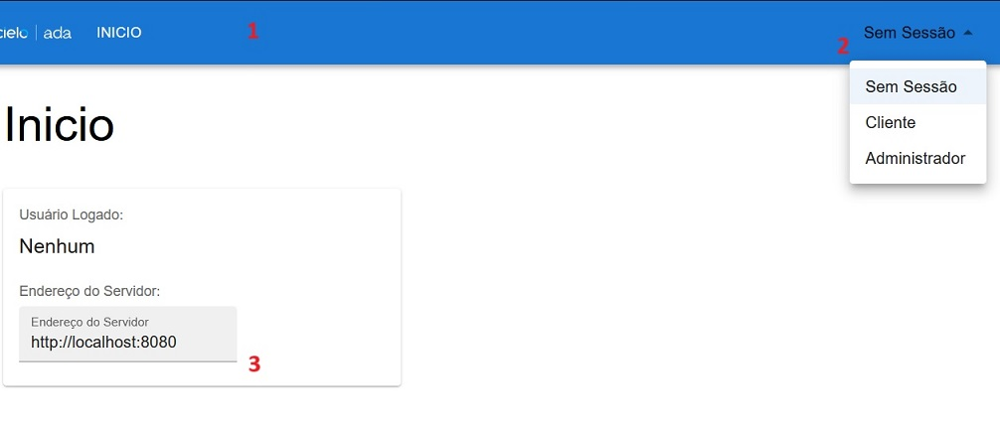

# Bootcamp Cielo Ouvidoria Frontend

Nesta aplicação, é possível enviar e consultar mensagens (gerenciadas por AWS SQS) através do nosso servidor JAVA.
A aplicação pode ser acessada em: https://lufemas.github.io/bootcamp-cielo-desafio1-ouvidoria-frontend/

## Rodar a aplicação localmente
Para rodar a aplicação localmente:
- Clone este repositório.
- Dentro da pasta raiz do repositório, rode o comando:
  ```
  npm run start
  ```
- A aplicação estará rodando na porta 3000.

## Arquitetura
- /components: Pasta onde estão componentes a serem utilizados nas páginas.
- /pages: Componentes que atuam como páginas da aplicação, geralmente acessadas através de uma rota.
- /services: Contexto central e serviços.
- ServicesContext.tsx: Contexto central que carrega instâncias únicas de todos os outros serviços:
  - ApiService: Responsável pelas chamadas ao servidor.
  - I18nService: Responsável pela tradução de tokens.
  - LoginService: Gerencia autenticação.

## Início
1. Navegação principal, as opções serão diferentes dependendo do usuário logado.
2. Selecione o usuário para fazer login.
3. É possível alterar o endereço padrão do servidor.


## Enviar Mensagem
É possível enviar mensagem apenas quando logado como 'Cliente'.

## Listar Filas e Tamanho
É possível acessar as filas e seus tamanhos ao fazer login com usuário 'Administrador'.

## Scripts Disponíveis

No diretório do projeto, você pode executar:

### `npm start`

Executa a aplicação no modo de desenvolvimento.\
Abra [http://localhost:3000](http://localhost:3000) para visualizá-la no navegador.

A página será recarregada se você fizer edições.\
Você também verá quaisquer erros de lint no console.

### `npm test`

Inicia o executor de testes no modo interativo de observação.\
Consulte a seção sobre [execução de testes](https://facebook.github.io/create-react-app/docs/running-tests) para obter mais informações.

### `npm run build`

Compila a aplicação para produção na pasta `build`.\
Ele agrupa o React corretamente no modo de produção e otimiza a compilação para obter o melhor desempenho.

A compilação é minificada e os nomes dos arquivos incluem os hashes.\
Sua aplicação está pronta para ser implantada!

Consulte a seção sobre [implantação](https://facebook.github.io/create-react-app/docs/deployment) para obter mais informações.
